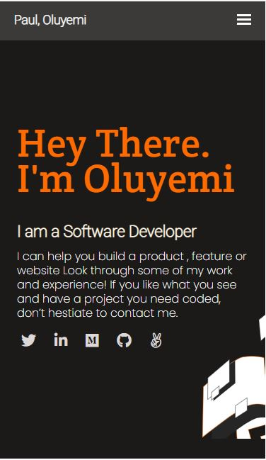

# Mobile Project2.0
## A mobile version of my portfolio

### screen Shot of Portfolio Projection (Introduction Section)

.

#### Link to my portfolio (https://ol-create.github.io/Mobile-Project2.0/)

## Built With

- html
- css
- vscode
- git
- github

👤 **Author**

- GitHub: [@githubhandle](https://www.linkedin.com/in/paul-oluyemi-193966ab)
- Twitter: [@twitterhandle](https://twitter.com/OluyemiPaul99)
- LinkedIn: [LinkedIn](https://linkedin.com/in/paul-oluyemi-193966ab)

## 🤝 Contributing

Contributions, issues, and feature requests are welcome!

Feel free to check the [issues page](../../issues/).

## Show your support

Give a ⭐️ if you like this project!

## Acknowledgments

- Hat tip to anyone whose code was used
- Inspiration
- etc

## 📝 License

This project is [MIT](./MIT.md) licensed.

